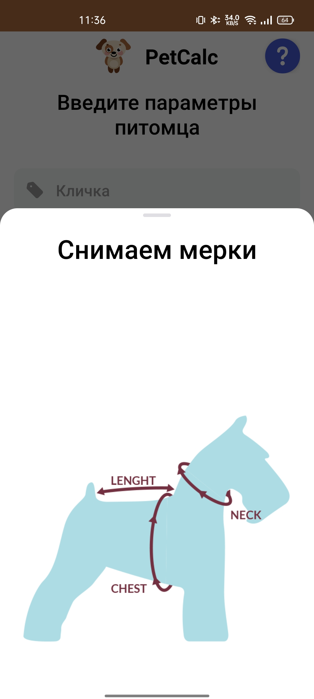

!

<h1 align="center">PetCalc</h1>

  
PetCalc -  Android приложение для расчета размеров ваших питомцев. При разработке данного приложеия учитывались простота, удобство использования и скорость расчетов. Данное приложение обеспечит Вас точными данными, для выбора одежды вашего питомца.

Скриншоты
--------

  
  
  

Функции
--------

* Расчет размеров питомца.
* Сохранение введенных данных.
* Просмотр сохраненных данных.
* Удаление данных.
* Помощь в измерении питомца.

Используемые библиотеки
--------------

* [kotlinx-coroutines](https://github.com/Kotlin/kotlinx.coroutines)
* [androidx.appcompat](https://developer.android.com/jetpack/androidx/releases/appcompat)
* [androidx.fragment](https://developer.android.com/jetpack/androidx/releases/fragment)
* [androidx.constraintlayout](https://developer.android.com/jetpack/androidx/releases/constraintlayout)
* [material-components](https://github.com/material-components/material-components-android)
* [hilt](https://developer.android.com/training/dependency-injection/hilt-android)
* [room](https://developer.android.com/jetpack/androidx/releases/room)